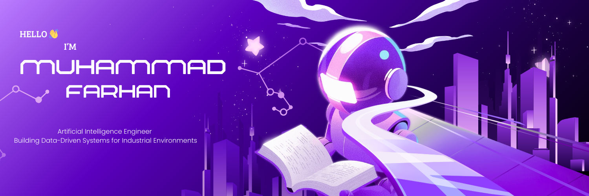

  

<h1 align="center">
  
</h1>

  
  

---

### 🌐 Overview

I am an Informatics Engineering student specializing in **Artificial Intelligence** with a strong professional foundation in **Industrial Quality Control (O&G/Manufacturing)**. My mission is to transform traditional industrial workflows into intelligent, autonomous decision frameworks.

---

### 🛠️ Core Stack & Expertise

<table width="100%">
  <tr>
    <td width="50%" valign="top">
      <h4 align="center">💻 Tech Stack</h4>
      

        
        
        
        
         
        
        
        
      

    </td>
    <td width="50%" valign="top">
      <h4 align="center">🎯 Specialization</h4>
      <ul>
        <li><b>Predictive Maintenance (PdM)</b></li>
        <li><b>Industrial Computer Vision</b></li>
        <li><b>ISO 9001:2015 Data Traceability</b></li>
        <li><b>Anomaly Detection</b></li>
      </ul>
    </td>
  </tr>
</table>

---

### 🏗️ Industrial Foundation to AI Roadmap

| Domain              | Transformation Objective                 | Tools                    |
| :------------------ | :--------------------------------------- | :----------------------- |
| **Quality Control** | Automating visual inspection with CV     | `OpenCV`, `PyTorch`      |
| **Manufacturing**   | Reducing downtime via failure prediction | `Scikit-Learn`, `Pandas` |
| **ISO Standards**   | Standardizing AI model documentation     | `MLflow`, `DVC`          |

---

### 📂 Featured Learning Projects

> [!TIP]
> **Check out my latest research:** [Industrial Sensor Anomaly Detection](https://github.com/mfarhan-dev) — _An exploratory analysis of sensor behavior in manufacturing environments._

---

### 📈 Activity & Insights

  
  

  

---

  <i>"Bridging the gap between physical operations and digital intelligence."</i>
   
  

