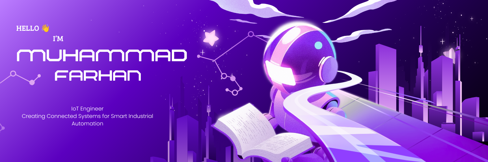

  

<h1 align="center">
  
</h1>

  
  
  

---

### 🌐 Professional Overview

I am an **Informatics Engineering** student with a solid background in **Industrial Quality Control (O&G/Manufacturing)**, specializing in **Automation & Industrial IoT (IIoT)**. I bridge field-level operations (sensors, actuators, PLCs) with modern software systems, web dashboards, and automated workflows.

- 🔭 **Current Focus:** Industrial Edge Computing, Smart Telemetry System, & Automated Workflow Integration.
- ⚡ **Mission:** Converting manual and legacy industrial processes into interconnected, real-time, and automated systems.
- 🛡️ **Standards:** Integrating **ISO 9001:2015** quality logic, strict data traceability, and fault-tolerant system architecture.

---

### 🛠️ Technical Ecosystem

| Category | Tools & Technologies |
| :--- | :--- |
| **IoT & Embedded Systems** |    **C/C++** |
| **Industrial Protocols** | **MQTT** • **Modbus RTU/TCP** • **HTTP/REST API** • **WebSocket** • **OPC UA** |
| **Automation & Integration** |    **Webhook Automation** |
| **Web & Monitoring UI** |     |
| **DevOps & Infrastructure** |   **VS Code Container Workspaces** |

---

### 🏗️ Industrial Foundation to Automation Roadmap

> "From manual inspection to seamless physical-to-digital automation."

- **Quality Control ➡️ Automated Data Logging:** Replacing pen-and-paper inspection logs with automated sensor logging and edge data collection.
- **Physical Operations ➡️ IoT Monitoring:** Deploying telemetry hardware to stream real-time environmental and machine parameters.
- **Workflow Automation ➡️ System Synergy:** Using tools like **n8n** and webhooks to trigger instant alerts, sync databases, and automate report generation.

---

### 📂 Featured Projects & Architectures

| Project | Description | Tech Stack |
| :--- | :--- | :--- |
| 📡 **[IIoT Telemetry & Monitoring](https://github.com/HanTechs)** | Real-time sensor telemetry architecture for monitoring industrial parameters with low latency. | `ESP32`, `MQTT`, `Docker`, `Laravel` |
| 🤖 **[Automated System Integration Workflow](https://github.com/HanTechs)** | End-to-end automation pipeline connecting IoT events, database triggers, and notification systems. | `n8n`, `Webhooks`, `Docker`, `REST API` |
| 🏥 **[MedisGo - Management System](https://github.com/HanTechs)** | Digital administration platform for campus clinic services, streamlining registration and queue workflows. | `Laravel`, `Livewire`, `TailwindCSS` |

---

### 📈 GitHub Insights & Productivity

  
  &nbsp;
  

  

**Contribution Snake:**

  

  
   
  <i>"Automating processes, bridging hardware with software intelligence."</i>

